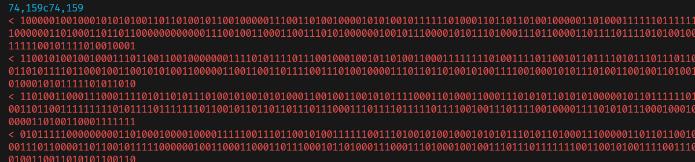

# Binary Zoetrope

Given 1540 text files, each file has 240 lines of which each line has 320 characters, in which each character is either a 1 or a 0. 

Initial approach was to check if the binary encoded meant something and then checking what the difference was betweeen each consecutive file. And then we notice there is specific difference between consecutive binary. Either they are inverse of each other with a few character difference which is interesting. 



After looking at the challenge name, Zoetrope means images that are displayed to form an animation. Our best guess is that these text files form an image which compiled give an animation. So we ask chatgpt to do the heavy lifting for us.

```python
from PIL import Image
import os
from glob import glob

def create_image(file_path):
    with open(file_path, 'r') as file:
        lines = file.readlines()

    height = len(lines)
    width = len(lines[0].strip())

    image = Image.new('1', (width, height), color=0)

    for y, line in enumerate(lines):
        for x, char in enumerate(line.strip()):
            pixel_value = int(char)
            image.putpixel((x, y), pixel_value)

    return image

def compile_images_into_gif(folder_path, output_path='output.gif'):
    image_files = glob(os.path.join(folder_path, '*.txt'))
    images = [create_image(file_path) for file_path in image_files]

    # Save the images as frames in a GIF
    images[0].save(output_path, save_all=True, append_images=images[1:], duration=100, loop=0)

if __name__ == "__main__":
    folder_path = 'data'  # Replace with the actual path to your files
    compile_images_into_gif(folder_path)
```

the end result is like this


`BITSCTF{n0w_u_c_m3}`