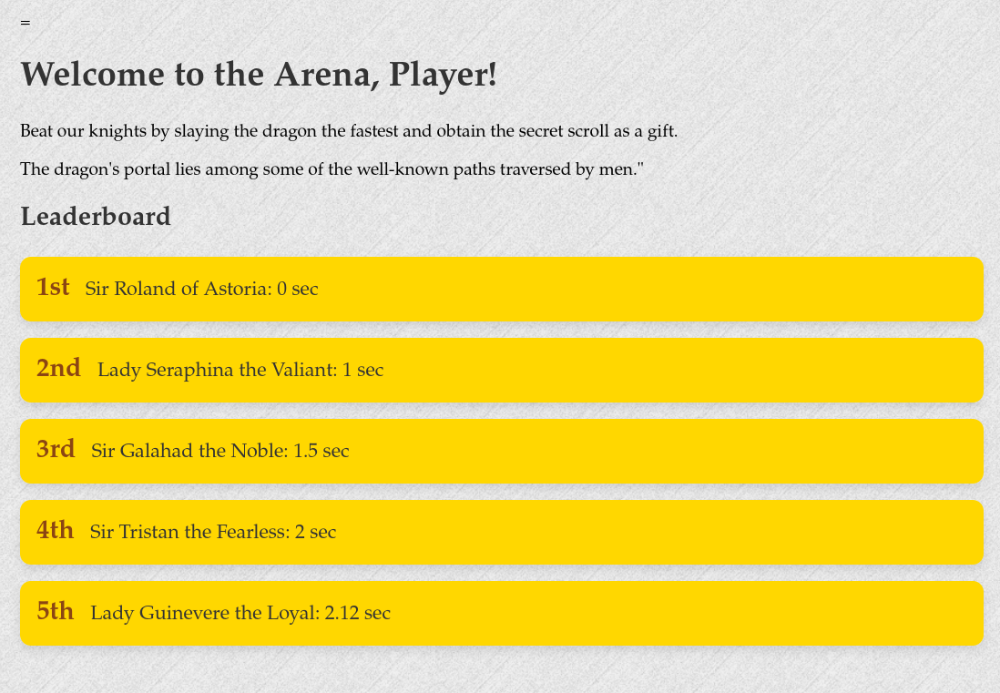

# Conquest

Category: Web

Solves: 62

### Given information

> Our Mogambro is a lucid dreamer who has meticulously replicated one of his sessions in the form of the given website. Can you also complete the quest which Mogambro failed to do?

> http://20.244.82.82:2913/

### Solution

The website presents a puzzle:

> Welcome Adventurer. You are about to take up on an impossible challenge.
> But first you gotta find the path that takes you to the arena

`/robots.txt` returns:

```
User-Agent: *
Disallow: /tournament
```

Upon visiting `/tournament` we are presented with a leaderboard for what looks like a dragon slaying tournament, and another puzzle:



---

Eventually we reach `/tournament/humans.txt`. This page presents an HTML form with two form inputs which return "Too Slow. Try Again!" upon submit:

-   Hidden text field with the value set to `1582510775.828625`
-   Submit button

```
<html lang="en">
<head>
    [...]
</head>
<body>
    <h1>BEWARE! SLAY THE DRAGON IF YOU DARE!</h1>
    <form action="/legend" method="post">
        <input type="hidden" value="1582510775.828625" name="slay">
        <input type="submit" value="Fight the Beast!">
    </form>
</body>
</html>
```

---

`1582510775.828625` is actually an [UNIX timestamp](https://en.wikipedia.org/wiki/Unix_time#Definition) that refers to `Mon Feb 24 07:49:35 AM IST 2020`, almost four years in the past.

After providing various inputs to the `slay` form input such as:

-   negative numbers
-   timestamps with micro (and milli) second offsets to `1582510775.828625`

We are able to obtain the flag on sending an absurdly large number: `1e308`.

Flag: `BITSCTF{7HE_r341_7r345Ur3_W45_7H3_Fr13ND5_W3_M4D3_410N6_7H3_W4Y}`
