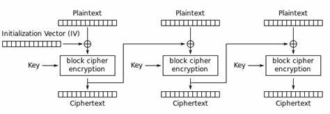

# Absolutely Encrypted Shenanigans

Domain: Crypto

Points: 477

Solves: 37

### Given information

> Lets see you break this. I even gave you the key

### Solution

Writeup author: Wixter_07

Given are two files `AES.py` and `server.py`

AES.py implements the custom AES.

```py
def xor(b1, b2):
    if len(b1)!=len(b2):
        raise ValueError("Lengths of byte strings are not equal")
    return bytes([b1[i]^b2[i] for i in range(len(b1))])

def bytes2matrix(text):
    return [list(text[i:i+4]) for i in range(0, len(text), 4)]

def matrix2bytes(matrix):
    s = b""
    for l in matrix:
        s += bytes(l)
    return s
    
def shift_rows(s):
    s[2][2], s[2][1], s[0][3], s[2][0], s[3][3], s[2][3], s[3][1], s[1][3], s[0][2], s[1][0], s[0][1], s[0][0], s[1][1], s[3][0], s[3][2], s[1][2] = s[2][2], s[3][3], s[0][0], s[1][1], s[2][1], s[1][2], s[3][0], s[2][3], s[0][3], s[0][2], s[3][2], s[0][1], s[3][1], s[1][0], s[2][0], s[1][3]
    return s


xtime = lambda a: (((a << 1) ^ 0x1B) & 0xFF) if (a & 0x80) else (a << 1)


def mix_single_column(a):
    t = a[0] ^ a[1] ^ a[2] ^ a[3]
    u = a[0]
    a[0] ^= t ^ xtime(a[0] ^ a[1])
    a[1] ^= t ^ xtime(a[1] ^ a[2])
    a[2] ^= t ^ xtime(a[2] ^ a[3])
    a[3] ^= t ^ xtime(a[3] ^ u)
    return a


def mix_columns(s):
    for i in range(4):
        s[i] = mix_single_column(s[i])
    return s


s_box = (
    0x63, 0x7C, 0x77, 0x7B, 0xF2, 0x6B, 0x6F, 0xC5, 0x30, 0x01, 0x67, 0x2B, 0xFE, 0xD7, 0xAB, 0x76,
    0xCA, 0x82, 0xC9, 0x7D, 0xFA, 0x59, 0x47, 0xF0, 0xAD, 0xD4, 0xA2, 0xAF, 0x9C, 0xA4, 0x72, 0xC0,
    0xB7, 0xFD, 0x93, 0x26, 0x36, 0x3F, 0xF7, 0xCC, 0x34, 0xA5, 0xE5, 0xF1, 0x71, 0xD8, 0x31, 0x15,
    0x04, 0xC7, 0x23, 0xC3, 0x18, 0x96, 0x05, 0x9A, 0x07, 0x12, 0x80, 0xE2, 0xEB, 0x27, 0xB2, 0x75,
    0x09, 0x83, 0x2C, 0x1A, 0x1B, 0x6E, 0x5A, 0xA0, 0x52, 0x3B, 0xD6, 0xB3, 0x29, 0xE3, 0x2F, 0x84,
    0x53, 0xD1, 0x00, 0xED, 0x20, 0xFC, 0xB1, 0x5B, 0x6A, 0xCB, 0xBE, 0x39, 0x4A, 0x4C, 0x58, 0xCF,
    0xD0, 0xEF, 0xAA, 0xFB, 0x43, 0x4D, 0x33, 0x85, 0x45, 0xF9, 0x02, 0x7F, 0x50, 0x3C, 0x9F, 0xA8,
    0x51, 0xA3, 0x40, 0x8F, 0x92, 0x9D, 0x38, 0xF5, 0xBC, 0xB6, 0xDA, 0x21, 0x10, 0xFF, 0xF3, 0xD2,
    0xCD, 0x0C, 0x13, 0xEC, 0x5F, 0x97, 0x44, 0x17, 0xC4, 0xA7, 0x7E, 0x3D, 0x64, 0x5D, 0x19, 0x73,
    0x60, 0x81, 0x4F, 0xDC, 0x22, 0x2A, 0x90, 0x88, 0x46, 0xEE, 0xB8, 0x14, 0xDE, 0x5E, 0x0B, 0xDB,
    0xE0, 0x32, 0x3A, 0x0A, 0x49, 0x06, 0x24, 0x5C, 0xC2, 0xD3, 0xAC, 0x62, 0x91, 0x95, 0xE4, 0x79,
    0xE7, 0xC8, 0x37, 0x6D, 0x8D, 0xD5, 0x4E, 0xA9, 0x6C, 0x56, 0xF4, 0xEA, 0x65, 0x7A, 0xAE, 0x08,
    0xBA, 0x78, 0x25, 0x2E, 0x1C, 0xA6, 0xB4, 0xC6, 0xE8, 0xDD, 0x74, 0x1F, 0x4B, 0xBD, 0x8B, 0x8A,
    0x70, 0x3E, 0xB5, 0x66, 0x48, 0x03, 0xF6, 0x0E, 0x61, 0x35, 0x57, 0xB9, 0x86, 0xC1, 0x1D, 0x9E,
    0xE1, 0xF8, 0x98, 0x11, 0x69, 0xD9, 0x8E, 0x94, 0x9B, 0x1E, 0x87, 0xE9, 0xCE, 0x55, 0x28, 0xDF,
    0x8C, 0xA1, 0x89, 0x0D, 0xBF, 0xE6, 0x42, 0x68, 0x41, 0x99, 0x2D, 0x0F, 0xB0, 0x54, 0xBB, 0x16,
)

    
def add_round_key(s, k):
    ns = []
    for i in range(4):
        ns.append([])
        for j in range(4):
            ns[i].append(s[i][j]^k[j][i])
    return ns

def sub_bytes(s, sbox=s_box):
    resmatrix = []
    for i in range(4):
        resmatrix.append([])
        for j in range(4):
            hexval=hex(s[i][j])[2:]
            if len(hexval)==1:
                a,b = 0,int(hexval,16)
            else:
                a,b = int(hexval[0],16), int(hexval[1],16)
            resmatrix[i].append(sbox[a*16+b])
            
    return resmatrix


N_ROUNDS = 10


def expand_key(master_key):
    r_con = (
        0x00, 0x01, 0x02, 0x04, 0x08, 0x10, 0x20, 0x40,
        0x80, 0x1B, 0x36, 0x6C, 0xD8, 0xAB, 0x4D, 0x9A,
        0x2F, 0x5E, 0xBC, 0x63, 0xC6, 0x97, 0x35, 0x6A,
        0xD4, 0xB3, 0x7D, 0xFA, 0xEF, 0xC5, 0x91, 0x39,
    )
    key_columns = bytes2matrix(master_key)
    iteration_size = len(master_key) // 4
    i = 1
    while len(key_columns) < (N_ROUNDS + 1) * 4:
        word = list(key_columns[-1])
        if len(key_columns) % iteration_size == 0:
            word.append(word.pop(0))
            word = [s_box[b] for b in word]
            word[0] ^= r_con[i]
            i += 1
        elif len(master_key) == 32 and len(key_columns) % iteration_size == 4:
            word = [s_box[b] for b in word]
        word = bytes(i^j for i, j in zip(word, key_columns[-iteration_size]))
        key_columns.append(word)
    return [key_columns[4*i : 4*(i+1)] for i in range(len(key_columns) // 4)]


def encrypt_block(key, pt_block):
    round_keys = expand_key(key)
    state = bytes2matrix(pt_block)
    state = add_round_key(state, round_keys[0])
    state = sub_bytes(state)
    state = shift_rows(state)

    for i in range(1,N_ROUNDS):
        state = mix_columns(state)
        state = add_round_key(state, round_keys[i])
        state = sub_bytes(state)
        state = shift_rows(state)
    
    state = add_round_key(state, round_keys[N_ROUNDS])
    ct_block = matrix2bytes(state)

    return ct_block


def encrypt(key, plaintext, mode="ECB", iv=None):
    if len(plaintext)%16 != 0:
        raise ValueError("Invalid Plaintext")
    elif len(key)!=16:
        raise ValueError("Invalid Key")
    ciphertext = b""
    if mode=="ECB":
        for i in range(0, len(plaintext), 16):
            ciphertext += encrypt_block(key, plaintext[i: i+16])
        
    elif mode=="CBC":
        if (iv==None or len(iv)!=16):
            raise ValueError("Invalid IV")
        ciphertext += iv
        for i in range(0, len(plaintext), 16):
            ciphertext += encrypt_block(key, xor(ciphertext[i: i+16], plaintext[i: i+16]))
        
    return ciphertext[16:]


def pad(text, blocksize):
    padding_len = blocksize - (len(text)%blocksize)
    padding = bytes([padding_len])*padding_len
    return text+padding

```

server.py has the challenge we need to exploit

```py
from AES import encrypt, pad
from redacted import secret, flag, EXIT
import json
import os

plaintext = pad(flag, 16)

for _ in range(10):
    iv = os.urandom(8)*2
    key = os.urandom(16) 
    try:
        ciphertext = encrypt(key, plaintext, mode="CBC", iv=iv)
    except:
        EXIT()
    print(json.dumps({
        'key': key.hex(),
        'ciphertext': ciphertext.hex()
    }))
    inp = input("Enter iv: ")
    if (iv.hex() != inp):
        EXIT()
    print()

plaintext = pad(secret, 16)
iv = os.urandom(8)*2
key = os.urandom(16)
try:
    ciphertext = encrypt(key, plaintext, mode="CBC", iv=iv) 
except:
    EXIT()
print(json.dumps({
    'key': key.hex(),
    'ciphertext': ciphertext.hex()
}))
```

We see IV is being generated as `iv = os.urandom(8)*2`. That mean if IV generate is 
```bash
b'\x12\x34\x56\x78\x9a\xbc\xde\xf0'
```
it'd become 
```bash
b'\x12\x34\x56\x78\x9a\xbc\xde\xf0\x12\x34\x56\x78\x9a\xbc\xde\xf0'
```
after duplication from `*2`.

We know that only the first block of plaintext flag is XOR'd with the IV as you can see


We know the flag begins with `KashiCTF` which is exactly 8 bytes. 

```
D1 (Intermediate) = IV ^ PT1
IV = PT1 ^ D1
```

Since we know the key and ciphertext, we can XOR first 8 bytes of the first intermediate block of ciphertext which we can get by decrypting first block of ciphertext, with `KashiCTF` and duplicate the result to recover the IV.

Part of the challenge is reversing the custom AES implementation which once done makes things easy.

```py

def xor(b1, b2):
    if isinstance(b1, bytes) and isinstance(b2, bytes):
        return bytes(x ^ y for x, y in zip(b1, b2))
    return bytes([b1[i]^b2[i] for i in range(len(b1))])

def bytes2matrix(text):
    return [list(text[i:i+4]) for i in range(0, len(text), 4)]

def matrix2bytes(matrix):
    s = b""
    for l in matrix:
        s += bytes(l)
    return s
    
def shift_rows(s):
    s[2][2], s[2][1], s[0][3], s[2][0], s[3][3], s[2][3], s[3][1], s[1][3], s[0][2], s[1][0], s[0][1], s[0][0], s[1][1], s[3][0], s[3][2], s[1][2] = s[2][2], s[3][3], s[0][0], s[1][1], s[2][1], s[1][2], s[3][0], s[2][3], s[0][3], s[0][2], s[3][2], s[0][1], s[3][1], s[1][0], s[2][0], s[1][3]
    return s

def inv_shift_rows(s):
    s[2][2], s[3][3], s[0][0], s[1][1], s[2][1], s[1][2], s[3][0], s[2][3], s[0][3], s[0][2], s[3][2], s[0][1], s[3][1], s[1][0], s[2][0], s[1][3] = s[2][2], s[2][1], s[0][3], s[2][0], s[3][3], s[2][3], s[3][1], s[1][3], s[0][2], s[1][0], s[0][1], s[0][0], s[1][1], s[3][0], s[3][2], s[1][2]
    return s

xtime = lambda a: (((a << 1) ^ 0x1B) & 0xFF) if (a & 0x80) else (a << 1)

def mix_single_column(a):
    t = a[0] ^ a[1] ^ a[2] ^ a[3]
    u = a[0]
    a[0] ^= t ^ xtime(a[0] ^ a[1])
    a[1] ^= t ^ xtime(a[1] ^ a[2])
    a[2] ^= t ^ xtime(a[2] ^ a[3])
    a[3] ^= t ^ xtime(a[3] ^ u)
    return a

def mix_columns(s):
    for i in range(4):
        s[i] = mix_single_column(s[i])
    return s

def inv_mix_columns(s):
    for i in range(4):
        s[i] = inv_mix_single_column(s[i])
    return s

def inv_mix_single_column(a):
    mult_9  = lambda x: xtime(xtime(xtime(x))) ^ x
    mult_11 = lambda x: xtime(xtime(xtime(x))) ^ xtime(x) ^ x
    mult_13 = lambda x: xtime(xtime(xtime(x))) ^ xtime(xtime(x)) ^ x
    mult_14 = lambda x: xtime(xtime(xtime(x))) ^ xtime(xtime(x)) ^ xtime(x)
    
    temp = a.copy()
    a[0] = mult_14(temp[0]) ^ mult_11(temp[1]) ^ mult_13(temp[2]) ^ mult_9(temp[3])
    a[1] = mult_9(temp[0]) ^ mult_14(temp[1]) ^ mult_11(temp[2]) ^ mult_13(temp[3])
    a[2] = mult_13(temp[0]) ^ mult_9(temp[1]) ^ mult_14(temp[2]) ^ mult_11(temp[3])
    a[3] = mult_11(temp[0]) ^ mult_13(temp[1]) ^ mult_9(temp[2]) ^ mult_14(temp[3])
    return a

s_box = (
    0x63, 0x7C, 0x77, 0x7B, 0xF2, 0x6B, 0x6F, 0xC5, 0x30, 0x01, 0x67, 0x2B, 0xFE, 0xD7, 0xAB, 0x76,
    0xCA, 0x82, 0xC9, 0x7D, 0xFA, 0x59, 0x47, 0xF0, 0xAD, 0xD4, 0xA2, 0xAF, 0x9C, 0xA4, 0x72, 0xC0,
    0xB7, 0xFD, 0x93, 0x26, 0x36, 0x3F, 0xF7, 0xCC, 0x34, 0xA5, 0xE5, 0xF1, 0x71, 0xD8, 0x31, 0x15,
    0x04, 0xC7, 0x23, 0xC3, 0x18, 0x96, 0x05, 0x9A, 0x07, 0x12, 0x80, 0xE2, 0xEB, 0x27, 0xB2, 0x75,
    0x09, 0x83, 0x2C, 0x1A, 0x1B, 0x6E, 0x5A, 0xA0, 0x52, 0x3B, 0xD6, 0xB3, 0x29, 0xE3, 0x2F, 0x84,
    0x53, 0xD1, 0x00, 0xED, 0x20, 0xFC, 0xB1, 0x5B, 0x6A, 0xCB, 0xBE, 0x39, 0x4A, 0x4C, 0x58, 0xCF,
    0xD0, 0xEF, 0xAA, 0xFB, 0x43, 0x4D, 0x33, 0x85, 0x45, 0xF9, 0x02, 0x7F, 0x50, 0x3C, 0x9F, 0xA8,
    0x51, 0xA3, 0x40, 0x8F, 0x92, 0x9D, 0x38, 0xF5, 0xBC, 0xB6, 0xDA, 0x21, 0x10, 0xFF, 0xF3, 0xD2,
    0xCD, 0x0C, 0x13, 0xEC, 0x5F, 0x97, 0x44, 0x17, 0xC4, 0xA7, 0x7E, 0x3D, 0x64, 0x5D, 0x19, 0x73,
    0x60, 0x81, 0x4F, 0xDC, 0x22, 0x2A, 0x90, 0x88, 0x46, 0xEE, 0xB8, 0x14, 0xDE, 0x5E, 0x0B, 0xDB,
    0xE0, 0x32, 0x3A, 0x0A, 0x49, 0x06, 0x24, 0x5C, 0xC2, 0xD3, 0xAC, 0x62, 0x91, 0x95, 0xE4, 0x79,
    0xE7, 0xC8, 0x37, 0x6D, 0x8D, 0xD5, 0x4E, 0xA9, 0x6C, 0x56, 0xF4, 0xEA, 0x65, 0x7A, 0xAE, 0x08,
    0xBA, 0x78, 0x25, 0x2E, 0x1C, 0xA6, 0xB4, 0xC6, 0xE8, 0xDD, 0x74, 0x1F, 0x4B, 0xBD, 0x8B, 0x8A,
    0x70, 0x3E, 0xB5, 0x66, 0x48, 0x03, 0xF6, 0x0E, 0x61, 0x35, 0x57, 0xB9, 0x86, 0xC1, 0x1D, 0x9E,
    0xE1, 0xF8, 0x98, 0x11, 0x69, 0xD9, 0x8E, 0x94, 0x9B, 0x1E, 0x87, 0xE9, 0xCE, 0x55, 0x28, 0xDF,
    0x8C, 0xA1, 0x89, 0x0D, 0xBF, 0xE6, 0x42, 0x68, 0x41, 0x99, 0x2D, 0x0F, 0xB0, 0x54, 0xBB, 0x16,
)

inv_s_box = (
    0x52, 0x09, 0x6A, 0xD5, 0x30, 0x36, 0xA5, 0x38, 0xBF, 0x40, 0xA3, 0x9E, 0x81, 0xF3, 0xD7, 0xFB,
    0x7C, 0xE3, 0x39, 0x82, 0x9B, 0x2F, 0xFF, 0x87, 0x34, 0x8E, 0x43, 0x44, 0xC4, 0xDE, 0xE9, 0xCB,
    0x54, 0x7B, 0x94, 0x32, 0xA6, 0xC2, 0x23, 0x3D, 0xEE, 0x4C, 0x95, 0x0B, 0x42, 0xFA, 0xC3, 0x4E,
    0x08, 0x2E, 0xA1, 0x66, 0x28, 0xD9, 0x24, 0xB2, 0x76, 0x5B, 0xA2, 0x49, 0x6D, 0x8B, 0xD1, 0x25,
    0x72, 0xF8, 0xF6, 0x64, 0x86, 0x68, 0x98, 0x16, 0xD4, 0xA4, 0x5C, 0xCC, 0x5D, 0x65, 0xB6, 0x92,
    0x6C, 0x70, 0x48, 0x50, 0xFD, 0xED, 0xB9, 0xDA, 0x5E, 0x15, 0x46, 0x57, 0xA7, 0x8D, 0x9D, 0x84,
    0x90, 0xD8, 0xAB, 0x00, 0x8C, 0xBC, 0xD3, 0x0A, 0xF7, 0xE4, 0x58, 0x05, 0xB8, 0xB3, 0x45, 0x06,
    0xD0, 0x2C, 0x1E, 0x8F, 0xCA, 0x3F, 0x0F, 0x02, 0xC1, 0xAF, 0xBD, 0x03, 0x01, 0x13, 0x8A, 0x6B,
    0x3A, 0x91, 0x11, 0x41, 0x4F, 0x67, 0xDC, 0xEA, 0x97, 0xF2, 0xCF, 0xCE, 0xF0, 0xB4, 0xE6, 0x73,
    0x96, 0xAC, 0x74, 0x22, 0xE7, 0xAD, 0x35, 0x85, 0xE2, 0xF9, 0x37, 0xE8, 0x1C, 0x75, 0xDF, 0x6E,
    0x47, 0xF1, 0x1A, 0x71, 0x1D, 0x29, 0xC5, 0x89, 0x6F, 0xB7, 0x62, 0x0E, 0xAA, 0x18, 0xBE, 0x1B,
    0xFC, 0x56, 0x3E, 0x4B, 0xC6, 0xD2, 0x79, 0x20, 0x9A, 0xDB, 0xC0, 0xFE, 0x78, 0xCD, 0x5A, 0xF4,
    0x1F, 0xDD, 0xA8, 0x33, 0x88, 0x07, 0xC7, 0x31, 0xB1, 0x12, 0x10, 0x59, 0x27, 0x80, 0xEC, 0x5F,
    0x60, 0x51, 0x7F, 0xA9, 0x19, 0xB5, 0x4A, 0x0D, 0x2D, 0xE5, 0x7A, 0x9F, 0x93, 0xC9, 0x9C, 0xEF,
    0xA0, 0xE0, 0x3B, 0x4D, 0xAE, 0x2A, 0xF5, 0xB0, 0xC8, 0xEB, 0xBB, 0x3C, 0x83, 0x53, 0x99, 0x61,
    0x17, 0x2B, 0x04, 0x7E, 0xBA, 0x77, 0xD6, 0x26, 0xE1, 0x69,0x14, 0x63, 0x55, 0x21, 0x0C, 0x7D,
)

def add_round_key(s, k):
    ns = []
    for i in range(4):
        ns.append([])
        for j in range(4):
            ns[i].append(s[i][j]^k[j][i])
    return ns

def sub_bytes(s, sbox=s_box):
    resmatrix = []
    for i in range(4):
        resmatrix.append([])
        for j in range(4):
            hexval=hex(s[i][j])[2:]
            if len(hexval)==1:
                a,b = 0,int(hexval,16)
            else:
                a,b = int(hexval[0],16), int(hexval[1],16)
            resmatrix[i].append(sbox[a*16+b])
    return resmatrix

def inv_sub_bytes(s, sbox=inv_s_box):
    resmatrix = []
    for i in range(4):
        resmatrix.append([])
        for j in range(4):
            hexval = hex(s[i][j])[2:]
            if len(hexval) == 1:
                a, b = 0, int(hexval, 16)
            else:
                a, b = int(hexval[0], 16), int(hexval[1], 16)
            resmatrix[i].append(sbox[a*16 + b])
    return resmatrix

N_ROUNDS = 10

def expand_key(master_key):
    r_con = (
        0x00, 0x01, 0x02, 0x04, 0x08, 0x10, 0x20, 0x40,
        0x80, 0x1B, 0x36, 0x6C, 0xD8, 0xAB, 0x4D, 0x9A,
        0x2F, 0x5E, 0xBC, 0x63, 0xC6, 0x97, 0x35, 0x6A,
        0xD4, 0xB3, 0x7D, 0xFA, 0xEF, 0xC5, 0x91, 0x39,
    )
    key_columns = bytes2matrix(master_key)
    iteration_size = len(master_key) // 4
    i = 1
    while len(key_columns) < (N_ROUNDS + 1) * 4:
        word = list(key_columns[-1])
        if len(key_columns) % iteration_size == 0:
            word.append(word.pop(0))
            word = [s_box[b] for b in word]
            word[0] ^= r_con[i]
            i += 1
        elif len(master_key) == 32 and len(key_columns) % iteration_size == 4:
            word = [s_box[b] for b in word]
        word = bytes(i^j for i, j in zip(word, key_columns[-iteration_size]))
        key_columns.append(word)
    return [key_columns[4*i : 4*(i+1)] for i in range(len(key_columns) // 4)]

def decrypt_block(key, ct_block):
    round_keys = expand_key(key)
    state = bytes2matrix(ct_block)
    
    state = add_round_key(state, round_keys[N_ROUNDS])
    
    for i in range(N_ROUNDS-1, 0, -1):
        state = inv_shift_rows(state)
        state = inv_sub_bytes(state)
        state = add_round_key(state, round_keys[i])
        state = inv_mix_columns(state)
    
    state = inv_shift_rows(state)
    state = inv_sub_bytes(state)
    state = add_round_key(state, round_keys[0])
    
    return matrix2bytes(state)

def decrypt(key, ciphertext, mode="ECB", iv=None):
    if len(ciphertext) % 16 != 0:
        raise ValueError("Invalid Ciphertext")
    elif len(key) != 16:
        raise ValueError("Invalid Key")
        
    plaintext = b""
    if mode == "ECB":
        for i in range(0, len(ciphertext), 16):
            plaintext += decrypt_block(key, ciphertext[i:i+16])
    
    elif mode == "CBC":
        if iv is None or len(iv) != 16:
            raise ValueError("Invalid IV")
        prev_block = iv
        for i in range(0, len(ciphertext), 16):
            decrypted_block = decrypt_block(key, ciphertext[i:i+16])
            plaintext += xor(prev_block, decrypted_block)
            prev_block = ciphertext[i:i+16]
    
    return plaintext

def unpad(padded_data):
    padding_len = padded_data[-1]
    return padded_data[:-padding_len]

def main():
    key = bytes.fromhex("<KEY>")
    ciphertext = bytes.fromhex("<CIPHERTEXT>")
    known_pt = b"KashiCTF"
    
    # Decrypt first block and find IV
    first_block = ciphertext[:16]
    decrypted = decrypt_block(key, first_block)
    iv_half = xor(decrypted[:8], known_pt)
    iv = iv_half * 2
    print(f"IV (hex): {iv.hex()}")
    
    plaintext = decrypt(key, ciphertext, mode="CBC", iv=iv)
    print(f"Plaintext: {plaintext}")
    
if __name__ == "__main__":
    main()
```

Now get correct IV 10 times on the nc and remember to decrypt at each step, the first 9 iterations will give you fake flags and the 10th one the flag

The flag - **`KashiCTF{AES_Unbr34KAbl3_but_t0T4lly_br3Akable_mAyb3_ccf4QCYV}`**
