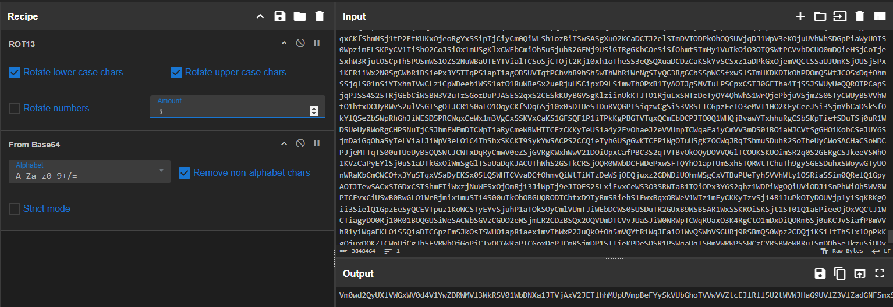
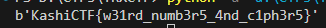

# MMDLX

Domain: Cryptography

Points: 454

Solves: 52

### Given information

> Although I know only a fraction of their history, but I think Romans have done many weird things in life. But this is a very basic challenge, right?

[`MMDLX.txt`](MMDLX.txt)

### Solution

Writeup author: ic3d_lemon

Straight of the get go, we are given a base64 which is not immediately interpreted as one by cyber chef, \
indicating something is wrong with the given b64 string itself. Upon decoding it gave random bytes. \
This and `Romans` being mentioned in the description perhaps hinted at some sort of caesar cipher being involved. \
And yes, at `ROT-3` then b64 decoding, You get a valid string, not random bytes, and its another b64 : \


You could keep on decoding the resulting b64, it kept given another valid b64. \
Clearly, said process was too tedious to be done manually \
Therefore wrote this "script" :
```py
from base64 import *

dec = # the string you get after rot3
while True:
    try:
        dec = b64decode(dec)
    except Exception:
        print(dec)
        break
```

And eventually \
 

Flag: `KashiCTF{w31rd_numb3r5_4nd_c1ph3r5}`
