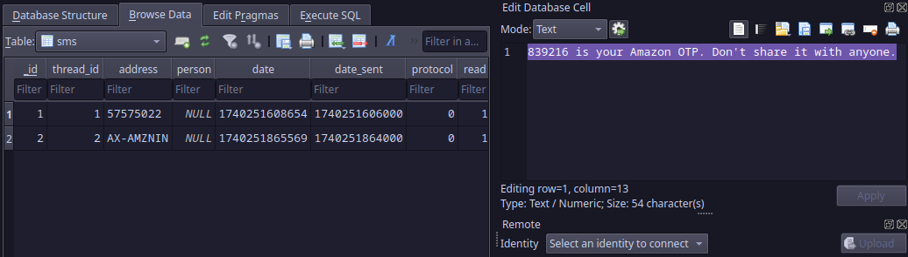

# Do Not Redeem #1

Domain: Forensics

Points: 319

Solves: 102

### Given information

> Uh oh, we're in trouble again. Kitler's Amazon Pay wallet got emptied by some scammer. Can you figure out the OTP sent to kitler right before that happened, as well as the time (unix timestamp in milliseconds) at which kitler received that OTP? Flag format: KashiCTF{OTP_TIMESTAMP}, i.e. KashiCTF{XXXXXX_XXXXXXXXXXXXX}

### Solution

Flag: `KashiCTF{839216_1740251608654}`

Writeup author: pseudonymous

## Do Not Redeem #1

* sms's are stored in a database known as 'mmssms.db'
* the directory wheres its stored is `kitler's-phone/data/data/com.android.providers.telephony/databases`

* upon opening ./mmssms.db in sqlitebrowser, in data -> sms
* data -> `839216 is your Amazon OTP. Don't share it with anyone.` timestamp -> `1740251608654`

* 

* wraping it around KashiCTF{otp_timestamp} gave the flag.
