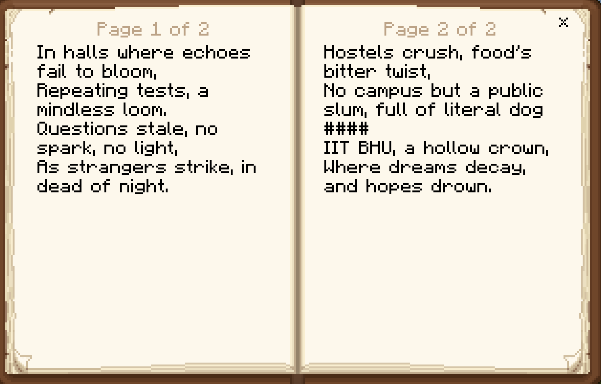

# Do Not Redeem #4

Domain: Forensics

Points: 500

Solves: 6

## Given information

>The scammer wrote a poem in a game they played with Kitler. They also shared a redeem voucher with Kitler. Can you find out what the voucher code was? Wrap your answer within KashiCTF{ and }
>
>Flag Format: KashiCTF{VoucherCode}
>
>Note: solving the previous part will be of great help in solving this one.
>
>Download kitler's-phone.tar.gz : Use the same file as in the challenge description of forensics/Do Not Redeem #1

## Solution

Writeup author: Dunruh

* Minecraft PE is the only game installed on Kitler's phone. All the worlds in Minecraft PE are stored in the `com.mojang.minecraftpe/games/com.mojang/minecraftWorlds/` directory. \

* There is only one world in the `minecraftWorlds` directory, named `0RjavQ==`. We can open this world in Minecraft Bedrock Edition by zipping the directory and changing the extension to `.mcworld`. 

* The world contains multiple structures and lots of books filled with red herrings. But in the previous challenge, we can find hints about the poem's location.


   ```
    "Nice, I play bedrock too"
    "It's the name I signed that poem with, the one I kept at my room in your beacon tower"
    "I wrote a poem, mind checking out?",
    "The view from here is downright fantastic",
    "Yup, it's all yours",
    "Can I keep the top floor of the tower for myself, then?",
    "Aah that didn't cross my mind. Can you help me build it?",
    "A nether elevator, then?",
    "I considered it, but it destroys the look",
    "it's a pain to climb up all the scaffolding, may I suggest a bubble column?",
    "this beacon tower is kinda cool"
  ``` 

* When we navigate to the beacon tower, we can find the poem in a book placed on a lectern.
  

* Removing the book from the lectern reveals the author's name, which doubles as the voucher code referenced in the challenge description.

  

* We get the flag by wrapping the voucher code in `KashiCTF{}`

  ```
  KashiCTF{KedA5hKr0f7}
  ```