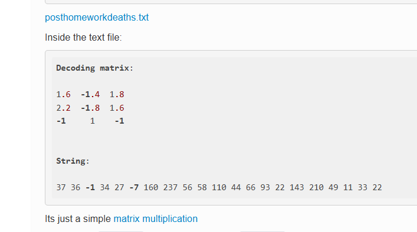
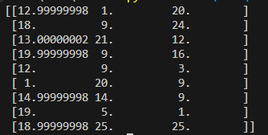

# Playing with numbers

Domain: misc

Points: 491

Solves: 24

### Given information

> I am weak in maths.. Can u help??
> Flag is in lowercase. Wrap the text in KashiCTF{}.

[`decoding_matrix_array.txt`](decoding_matrix_array.txt)

### Solution

Writeup author: ic3d_lemon

From the given attachment, we are given a 3x9 matrix and a 9 dimensional array 

One might instantly think of multiplying them, but a 3 lettered flag would make no sense \
So clearly, the flag was encoded into the given matrix. 

A while later a teammate fished out this \
`https://ctftime.org/writeup/20280` \

very similar handout... 

So I tried copying what they did there, and a few trial and errors later \
tried the process of `decoding_array (transposed)` * `the_given_vector (rearranged to dimensions 3x3)` \
And yes, that gave numbers falling in the exact range of 0-26 (although had to round them off). \
 

On mapping them to the alphabets, the result seemed one letter off of saying `matrix` in there, \
so just `ROT -1`'d (if you can call it that) and got flag 

solve script :
```py
import numpy as np

A = np.array([
   [-103.08333333, -131.25, -81.41666667, -91.58333333, -25.25, -63.5, -60.33333333, -12.75, -151.08333333],
   [-40.5, -52.5, -34.5, -36.5, -10.5, -28.0, -25.0, -4.5, -62.5],
   [42.58333333, 54.75, 34.91666667, 39.08333333, 11.75, 26.5, 26.33333333, 7.25, 63.58333333]
]).T

B = np.array([[2, 4, -1,],
              [ 3, -6, 1],
              [8, 4, -1]
])

C = np.dot(A,B)
# print(C)

charset="abcdefghijklmnopqrstuvwxyz"
flag = "".join(charset[(x-1) % 26] for x in [int(round(x, 2)) for x in C.flatten()])
print("KashiCTF{" + flag + "}") # KashiCTF{matrixmultiplicationiseasyy}
```

Flag: `KashiCTF{matrixmultiplicationiseasyy}`