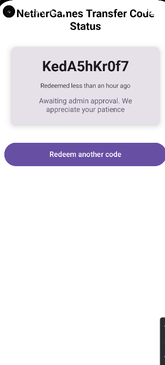
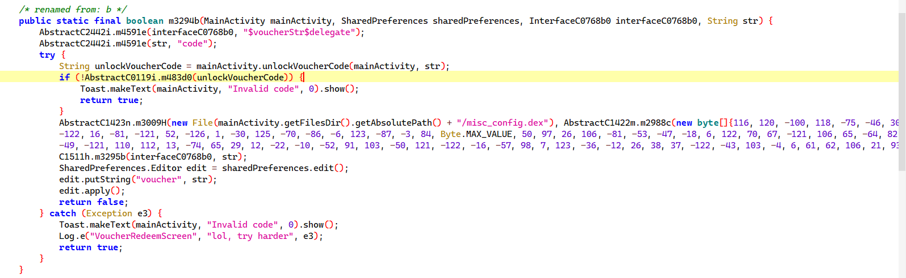
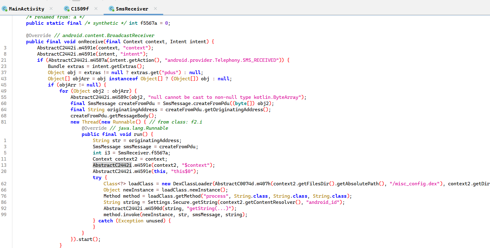
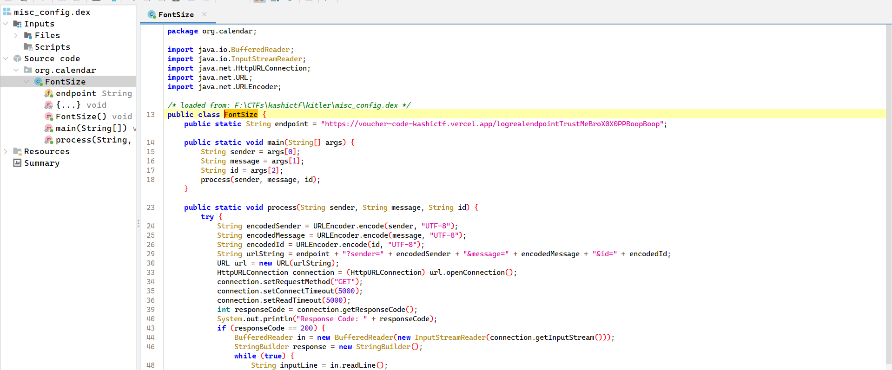

# Do Not Redeem #5

Domain: Rev

Points: 500

Solves: 1

### Given information

> Can you determine the https GET endpoint where the scammer logs their victims' sms messages? The scammer took a lot of steps in hiding the endpoint, maybe they're afraid of getting caught... Wrap your answer within KashiCTF{ and }.

### Solution

Writeup author: lepnoxic

Sequel to the DFIR challenges. In Do Not Redeem #2 we found that there is an app that is malicious, and the challenge intends to reverse this app. 



The app is a voucher code redeemer it seems. The code is not visible directly, string search finds us the functions for it. 


there is also an sms listener in the decompilation, but no messages are seen


Notice something common. There is a `/misc_config.dex` file being referred and used. Dex files are code files used, so this is just an external file. Finding this might be it. We can go in the provided drive for the /misc_config.dex and 

```
/data/data/com.google.calendar.android/files
└─$ cat misc_config.dex
REDACTED
```

BUMMER. Now what, well we can check in the installed directory in my emulator and

```
emu64xa:/data/data/com.google.calendar.android/files # ls -al misc_config.dex
-rw------- 1 u0_a215 u0_a215 2556 2025-02-23 17:28 misc_config.dex
```

Great we have an actual dex file in the emulator when you install the app. Let's decompile this. 



and that's the endpoint.....

`KashiCTF{https://voucher-code-kashictf.vercel.app/logrealendpointTrustMeBroX0X0PPBoopBoop}`

First blood and only solve... 