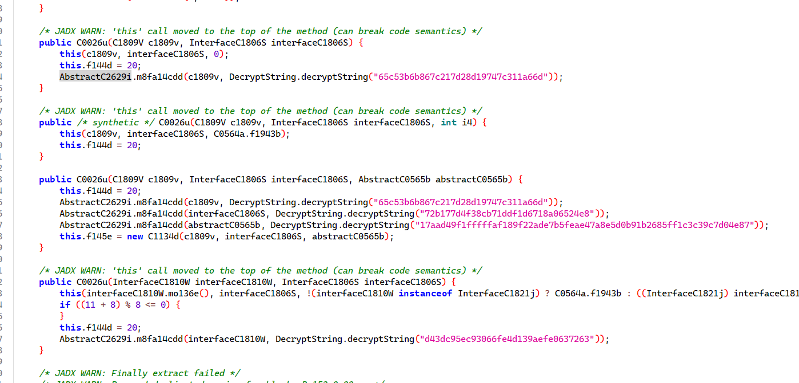
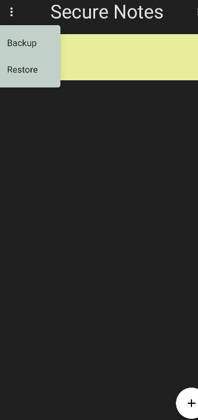
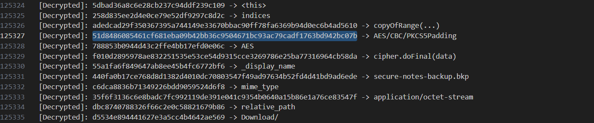
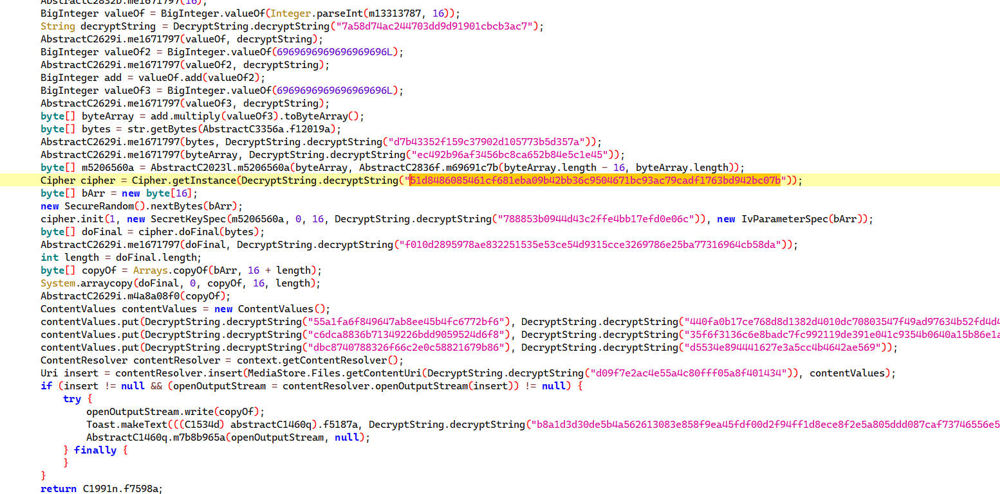

# Painfully Slow

Domain: Reverse

Points: 499 

Solves: 11

### Given information

> The new security update made this app so painfully slow I had to sell my degree for a Pixel 9 to get it running. But there's another problem now: I can't restore my old backup...

### Solution

Writeup author: lepnoxic

Given an android apk and a bkp file. The android app is a note taking app which is god awfully slow. Let's start by decompilation. The app appears to be made with kotlin so sadly all internal class names are lost and everything gets jumbled. But there are a few things to notice. Particularly with all the strings being in hex and being passed in the function `DecryptString`



This `DecryptString.decryptString` decodes all string from AES ECB, very secure, but aes decryption for each line will cause a lot of delay making the app so slow 😔

### Approach

Let's start looking at what we want, the app itself has a backup and restore option. It is presumed that the app itself had notes and a backup was created which is provided. We need to reverse the app and get the notes from the backup. 



But currently there is nothing to go off. I created some backup files for analysis and they were different everytime. but the unique thing is they were all multiple of 16 including the given backup file 🤔

This means there might be some block cipher involved. If we could look at the strings maybe we could identify the encryption. But there are too many of them. 

### Frida tools

[Frida](https://frida.re) is a nice toolset that hooks onto a function and extracts dynamically in an app. We can hook onto the DecryptString and tell it to catch every single decrypted string and print it or save it. This is the current script for it 

```js
Java.perform(function() {
    var DecryptString = Java.use("com.decryptstringmanager.DecryptString");

    DecryptString.decryptString.implementation = function(str) {
        var decrypted = this.decryptString(str);
        console.log("[Decrypted]: " + str + " -> " + decrypted);
        return decrypted; 
    };
});
```

We get a lot of output, after making a backup we finally notice something interesting. there is a string that decrypts as AES/CBC, this means that the backup is being encrypted with AES/CBC.


Let's find this string and go to it's function and analyze it.


We can start some reversing by placing the reversed strings we have here, the code becomes a little readable. After bit of code analysis we deduce that the encryption needs two things, the key and the iv. 

### Decryption

The IV is randomly generated, but good thing for us it's stored in the file before the encrypted data. So that is sorted. 

The Key is a harder situation. They key is referenced from `android_id`, then it is added and multipled with `6969696969696969696` (Nice) and used in the encryption. The problem is android_id is unique to the device and cannot be constant. I got the id of my emulator and started working around with the numbers to get the key, and thankfully because of 16 byte limit and the big calculations, only the last 3 bytes influence the calculation. This helps as it's just a 3 byte brute. 

With everything in place, we create a brutescript to get the notes out. 

```py
with open("secure-notes-backup.bkp", 'rb') as file:
    given = file.read()

from Cryptodome.Util.number import long_to_bytes
from Cryptodome.Cipher import AES
from Cryptodome.Util.Padding import unpad

iv = given[:16]
encrypted = given[16:]

for id in range(0, 0x1000000):
    try:
        key = long_to_bytes((id + 6969696969696969696) * 6969696969696969696)
        cipher = AES.new(key, AES.MODE_CBC, iv)
        print(unpad(cipher.decrypt(encrypted), block_size=AES.block_size).decode())
        exit(0)
    except:
        pass
```

or give this code to chatgpt to make it multithreaded to make it faster and give a progress bar also to make it fancy 👀

Eventually the three bytes hit, and we get the final notes backup. 

```json
[
  {
    "color": -21615,
    "content": "Access granted to {f5V-g4} command. Temporarily redirect traffic to #subnet! {Update} proxychains-0405 complete, initiating layer 3 bypass. Override input_d1ffr3nt @sandbox. Data spikes detected: {analysis} incomplete. Buffer overrun error: {S3v3r17y level:high} – recalibrate. Awaiting {keygen} response. Sequence obfuscated! X9F_purge complete",
    "id": 3,
    "timestamp": 1740062993464,
    "title": "Nuke Access Pwned"
  },
  {
    "color": -749647,
    "content": "Warning: Unsolicited {command} execution on node Z-r3x. Buffer overflow risk at location{4X} in RAM. Manual override required – engage test_protection level 8G. Re-routing through firewall-delta. {sync error} identified, solution encrypted in layer K-9. Rebooting {undefined} core, engage hardlock immediately. Intrusion log confirms {attempt} to decrypt_secure {c4dm1um_c0r3}. Proceed with force-quit after 3x retries. Data breach imminent!",
    "id": 4,
    "timestamp": 1740064791357,
    "title": "Sunday Log"
  },
  {
    "color": 36434,
    "content": "K",
    "id": 54,
    "timestamp": 1740060518247,
    "title": "Never gonna tell a lie and hurt you"
  },
  {
    "color": 469998,
    "content": "a",
    "id": 56,
    "timestamp": 1740060996851,
    "title": "Your heart's been aching, but you're too shy to say it"
  },
  {
    "color": 767362,
    "content": "s",
    "id": 18,
    "timestamp": 1740060285194,
    "title": "Your heart's been aching, but you're too shy to say it"
  },
  {
    "color": 1203932,
    "content": "h",
    "id": 7,
    "timestamp": 1740060730781,
    "title": "We know the game and we're gonna play it"
  },
  {
    "color": 1543074,
    "content": "i",
    "id": 27,
    "timestamp": 1740060427492,
    "title": "Never gonna let you down"
  }
```

Combine the contents to get the flag

```KashiCTF{r1P_Ch34P_o8FuSC471oN_7_7_Nu123_117_8Hu_87W}```
