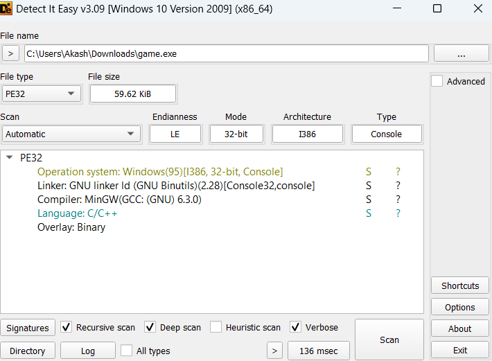
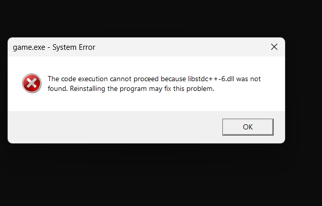
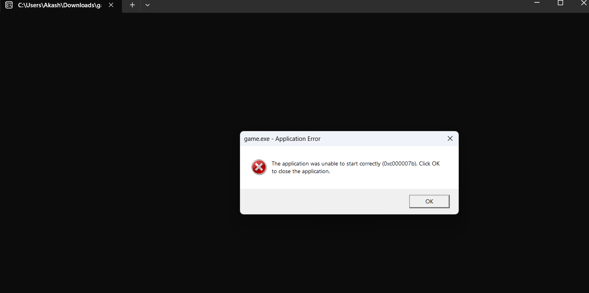
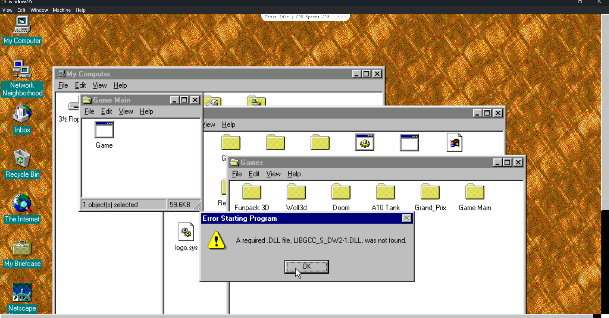
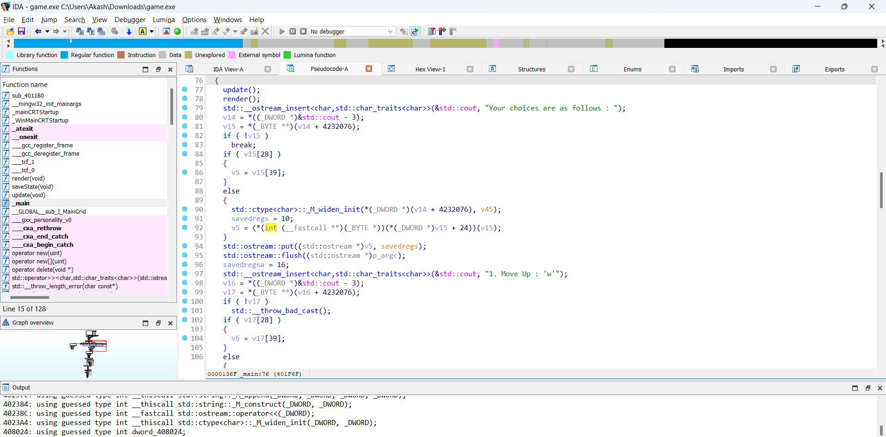
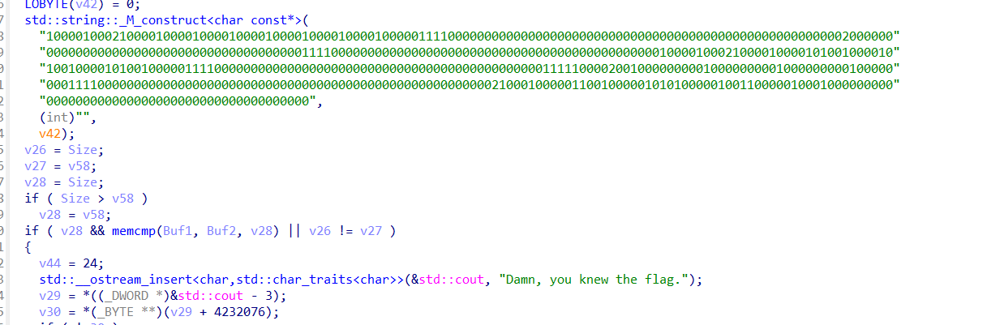
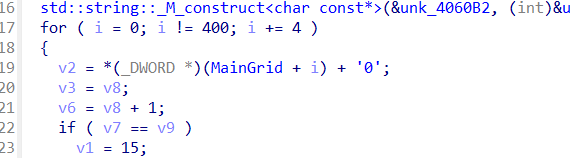

# GetYourOwnFlag

given a 32 bit PE. DIE:



i wanted to do dynamic analysis so i tried running it and oh boi it didn't work 😔





yeah gave up on running it. Static analysis, open in IDA:



so the PE most likely seems like a drawing emulator. There is up down left right and all. So let's try to find where there might be significance to the flag we want. there are only 4 important functions. main, render, saveState and update.

Going through the render function we see something interesting.



this string seems to contain our flag in some manner.

In save state function we can see that 0 is being added for 100 times. so the frame is 100 long. 



Now in the update function there is add function that adds 1 or 2 based on some functionality.

was pretty confused here how it worked.

I was talking with the author right before this and as hint and for compilation he released the source code given below.

this gave everything. the fact that 0,1,2 were save states and the height and width was 10,10 making it indeed 100 long. so we could just print each frame 10x10 accross the save state that was given and see what is the frame that was drawn.

```py
└─$ ipython
Python 3.11.8 (main, Feb  7 2024, 21:52:08) [GCC 13.2.0]
Type 'copyright', 'credits' or 'license' for more information
IPython 8.19.0 -- An enhanced Interactive Python. Type '?' for help.

In [1]: bruh = "10000100021000010000100001000010000100001000010000011110000000000000000000000000000000000000000000000000
   ...: 0000020000000000000000000000000000000000000000011110000000000000000000000000000000000000000000001000010002100001
   ...: 0000101001000010100100001010010000011110000000000000000000000000000000000000000000001111100002001000000000100000
   ...: 0000100000000010000000011110000000000000000000000000000000000000000000000000000002100010000011001000001010100000
   ...: 100110000010001000000000000000000000000000000000000000000000"

In [2]: for i in range(0,10):
   ...:     for j in range(0, 10):
   ...:         print(bruh[i * 10 + j], end="")
   ...:     print()
   ...:
1000010002
1000010000
1000010000
1000010000
1000010000
0111100000
0000000000
0000000000
0000000000
0000000000

In [3]: for i in range(0,10):
   ...:     for j in range(0, 10):
   ...:         print(bruh[100 + i * 10 + j], end="")
   ...:     print()
   ...:
0000000002
0000000000
0000000000
0000000000
0000000000
0111100000
0000000000
0000000000
0000000000
0000000000

In [4]: for i in range(0,10):
   ...:     for j in range(0, 10):
   ...:         print(bruh[200 + i * 10 + j], end="")
   ...:     print()
   ...:
1000010002
1000010000
1010010000
1010010000
1010010000
0111100000
0000000000
0000000000
0000000000
0000000000

In [5]: for i in range(0,10):
   ...:     for j in range(0, 10):
   ...:         print(bruh[300 + i * 10 + j], end="")
   ...:     print()
   ...:
1111100002
0010000000
0010000000
0010000000
0010000000
0111100000
0000000000
0000000000
0000000000
0000000000

In [6]: for i in range(0,10):
   ...:     for j in range(0, 10):
   ...:         print(bruh[400 + i * 10 + j], end="")
   ...:     print()
   ...:
0000000002
1000100000
1100100000
1010100000
1001100000
1000100000
0000000000
0000000000
0000000000
0000000000
```

thus after glaring at high speed we find the charcters to be `U_WIN`. Giving the flag

`0CTF{U_WIN}`


Source code: 

```cpp
#include <iostream>
#include <vector>
#include <cstdlib>
#define W 10
#define H 10

using namespace std;

// int player[] = {0, 1};

// char currentChoice = '+';

// string canvas[H]; // vector states;

// void update(){ // bool move = true; // int oldX = player[0]; // int oldY =
// player[1]; // switch (currentChoice) // { // case 'w': // player[1] -= 1; //
// break; // case 's': // player[1] += 1; // break; // case 'a': // player[0] -=
// 1; // break; // case 'd': // player[0] += 1; // break; // case 'p': // case
// 'c': // move = false; // break; // default: // cout << "Please enter a valid
// choice." << endl; // return; // break; // }

// player[0] = player[0] % W; // player[1] = player[1] % H;

// if(move){ // canvas[player[1]][player[0]] = '@'; // canvas[oldY][oldX] = ''
// // }

// } // void render(){ // system("cls"); // cout << string(W + 2, '#') << endl;
// // for(int y = 0; y < H; y++){ // cout << '#' << canvas[y] << '#' << endl; //
// } // cout << string(W + 2, '#') << endl; // cout << "States saved : " <<
// endl; // for(auto i = states.begin(); i != states.end(); ++i){ // cout << *i
// << endl; // } // }

// int main(){ // // Setting up canvas // for(int y = 0; y < H; y++){ //
// canvas[y] = string(W, ' '); // } // cout << "Your choices are as follows : "
// << endl; // cout << "1. Move Up : 'w'" << endl; // cout << "2. Move Down :
// 's'" << endl; // cout << "3. Move Left : 'a'" << endl; // cout << "4. Move
// Right : 'd'" << endl; // cout << "5. Move Paint : 'p" << endl; // cout << "6.
// Move Clear : 'c'" << endl;

// while(true){ // update(); // render(); // cout << "Enter your choice : "; //
// cin >> currentChoice; // }

// return 0; // }

using namespace std;

class Player {
   public:
    int x, y;
    Player(int x, int y) {
        this->x = x;
        this->y = y;
    }
};

int *MainGrid;
char currentChoice = ']';
Player player(0, 0);
vector states;

void render() {
    system("cls");
    cout << string(W + 2, '-') << endl;

    for (int y = 0; y < H; y++) {
        cout << '|';
        for (int x = 0; x < W; x++) {
            int point = *(MainGrid + y * W + x);
            if (point == 0)
                cout << " ";  // Unpainted
            else if (point == 1)
                cout << "@";  // Painted
            else if (point == 2)
                cout << "#";  // Unpainted, but player on tile.
            else if (point == 3)
                cout << "#";  // Implies, is painted and the player is on the
                              // tile.
            else {
                cerr << "How did this even happen." << point << x << y << endl;
                exit(1);
            }
        }
        cout << '|' << endl;
    }

    cout << string(W + 2, '-') << endl;

    string ultimateState = "";

    for (auto &i : states) {
        ultimateState += i;
        cout << i << endl;
    }

    // cout << ultimateState << endl;

    string flagStates =
        "1000010002100001000010000100001000010000100001000001111000000000000000"
        "0000000000000000000000000000000000000002000000000000000000000000000000"
        "0000000000011110000000000000000000000000000000000000000000001000010002"
        "1000010000101001000010100100001010010000011110000000000000000000000000"
        "0000000000000000000011111000020010000000001000000000100000000010000000"
        "0111100000000000000000000000000000000000000000000000000000021000100000"
        "1100100000101010000010011000001000100000000000000000000000000000000000"
        "0000000000";

    // The end target is the draw the flag and then that will verify the flag.
    // The solution would be to retrace the steps from the flag states given in
    // this.

    if (flagStates.compare(ultimateState)) {
        cout << "Damn, you knew the flag." << endl;
    }
}

void saveState() {
    string newState = "";
    for (int i = 0; i < W * H; i++) {
        newState += (char)(*(MainGrid + i) + '0');
    }
    states.emplace_back(newState);
}

void update() {
    if (currentChoice == 'q') {
        saveState();
        return;
    }

    bool move = true;
    int oldX = player.x;
    int oldY = player.y;
    switch (currentChoice) {
        case 'w':
            player.y -= 1;
            break;
        case 's':
            player.y += 1;
            break;
        case 'a':
            player.x -= 1;
            break;
        case 'd':
            player.x += 1;
            break;
        case 'p':
        case 'c':
            move = false;
            break;
        default:
            cout << "Please enter a valid choice." << endl;
            return;
            break;
    }

    player.x = player.x % W;
    player.y = player.y % H;

    if (move) {
        // *(MainGrid + oldY*W + oldX) &= ~((unsigned long)1 << 2); // Clearing
        // the 2nd bit
        // *(MainGrid + player.y*W + player.x) |= ((unsigned long)1 << 2); //
        // Setting the 2nd Bit
        //      if(point == 0) cout << " "; // Unpainted
        // else if(point == 1) cout << "@"; // Painted
        // else if(point == 2) cout << "#"; // Unpainted, but player on tile.
        // else if(point == 3) cout << "#"; // Implies, is painted and the
        // player is on the tile.
        int oldVal = *(MainGrid + oldY * W + oldX);
        int newVal = *(MainGrid + player.y * W + player.x);
        bool oldPainted = oldVal == 3;
        bool newPainted = newVal == 1;

        // if(oldPainted){
        //     *(MainGrid + oldY*W + oldX) = 1;
        // }else{
        //     *(MainGrid + oldY*W + oldX) = 0;
        // }
        *(MainGrid + oldY * W + oldX) = (int)oldPainted;

        // if(newPainted){
        //     *(MainGrid + player.y*W + player.x) = 3;
        // }else{
        //     *(MainGrid + player.y*W + player.x) = 2;
        // }
        *(MainGrid + player.y * W + player.x) = (int)newPainted + 2;
    } else {
        if (currentChoice == 'p') {
            // *(MainGrid + player.y*W + player.x) |= ((unsigned long)1 << 1);
            // // Setting the 1st bit
            *(MainGrid + player.y * W + player.x) = 3;
        } else if (currentChoice == 'c') {
            *(MainGrid + player.y * W + player.x) = 2;  // Clearing the 2nd bit.
        }
    }
}

int main() {
    MainGrid = new int[H * W];
    for (int y = 0; y < H; y++) {
        for (int x = 0; x < W; x++) {
            *(MainGrid + y * W + x) = 0;
        }
    }
    *(MainGrid + player.y * W + player.x) = 2;
    while (true) {
        update();
        render();
        cout << "Your choices are as follows : " << endl;
        cout << "1. Move Up : 'w'" << endl;
        cout << "2. Move Down : 's'" << endl;
        cout << "3. Move Left : 'a'" << endl;
        cout << "4. Move Right : 'd'" << endl;
        cout << "5. Move Paint : 'p" << endl;
        cout << "6. Move Clear : 'c'" << endl;
        cout << "7. Save state : 'q'" << endl;
        cout << "Enter your choice : " << endl;
        cin.clear();
        cin >> currentChoice;
    }
}
```