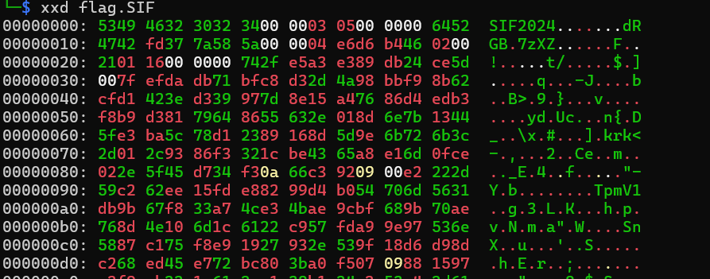
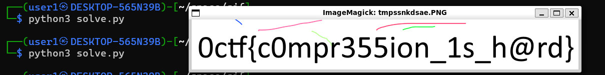

# Simplimistic Image Format

Given a website link that converts images to it's own format called sif which we need to reverse. Not given any source file which is interesting. We were initially not given a flag file but were supplied with it later. This more of became a forensics challenge than a reverse one after that.

First analysis of the hex of the file.



This shows that there is a header with `SIF2024`. The intersting part is later there is `7zxz` which is header for an xz archive. Doing binwalk on this confirms that this file is just a xz archive of data.

```
└─$ binwalk flag.SIF

DECIMAL       HEXADECIMAL     DESCRIPTION
--------------------------------------------------------------------------------
18            0x12            xz compressed data
```

now we locate what other parameters are here. This file resembles quite like a png. After staring at it for a millenia we can figure out that the header consits of the following parameters

- `SIF2024` - Magic bytes
- `00000305` - 4 bytes width
- `00000064` - 4 bytes height 
- `RGB` - Color encoding

whearas in the footer
- `THEEND` - Just magic bytes

so remove all this and you end up with just a xz file.

```
└─$ file flag1.SIF
flag1.SIF: XZ compressed data, checksum CRC64
```

unzip this with `xz -d`. you get data, which is most likely as with the encoding is just RGB data. so then ask chatgpt to create for you a script to read all that data and show you the image with the width and height you got.

```python
from PIL import Image

with open('/home/user1/space/sif/flag', 'rb') as file:
    rgb_data = file.read()

img = Image.new('RGB', (773, 100))

img.frombytes(rgb_data)

img.show()
```

the result is 



`0ctf{c0mpr355ion_1s_h@rd}`